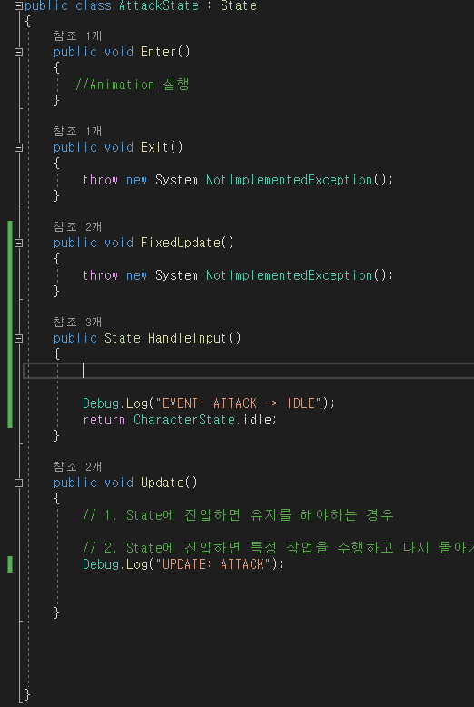

# Finite State Machine
일상생활속에서 여러개의 동작을 동시에 수행하는 경우가 존재한다. 예를 들면, 밥을 먹으면서 TV를 시청한다던가, 목욕을 하면서 노래를 듣는 등 멀티태스킹을 빈번히 수행하고 있다. 실제로 멀티태스킹은 동시에 두가지 동작을 수행하는 것이 아닌 두 가지 동작을 빠르게 반복하여 수행하는 것을 의미한다. 즉, 멀티태스킹은 동작의 전환을 빠르게 수행하는 것이다.   
동작 전환이 불가능 한 경우도 존재한다. 예를 들면 버스를 타는 행동과 밥을 먹는 행동은 동시에 수행이 불가능할 것이다. 현재 상태에서 버스 타기, 밥 먹기, 노래 하기, 옷 입기 등등 다음 동작을 수행하기 위해 설계하는 모듈을 FSM(Finite State Machine)이라고 한다.

# 소개하게된 이유
게임을 제작하던 도중에 고민거리가 생겼다. 캐릭터의 장비 동작, 이동 동작, 공격 동작을 구현했는데, 캐릭터가 공격하는 도중에 장비를 바꾸는 경우가 생기지 않도록 하고 싶었다.

  
처음에는 admin이라는 관리자에 Subscribe 함수로 가입되는 함수 순으로 처리 우선 순위를 부여하고 공격 동작이 종료되지않았으면 다른 동작들은 수행하지 못하도록 했다.
결과는 성공적으로 우선 순위에 따라서 제어 처리가 가능했다.  

하지만 이동 동작의 경우 원래는 Update() 함수 내에서 사용했었으나 FixedUpdate()로 바꿔야하는 상황이 발생했다. "position += deletaTime * velocity" 형태로 썼었는데, 움직임을 자연스럽게 만들기 위해서는 힘(Force)를 사용해야했고 따라서 FixedUpdate() 내에서 이동 동작(Position Update)가 이루어져야했다.

따라서 단순히 우선 순위를 부여하는 방법만으로는 해결이 안된다고 생각했고 번뜩 들었던 생각이 Unity의 Animator 구조였다.

  
Unity의 Animator의 경우 State를 이동하며 현재 상태에서 다음 상태로 이동하여 유연하게 상태간의 이동이 가능하다.

따라서 이러한 구조의 모듈을 만들면 상태간의 이동에 있어서 해석하기 쉬워지고 우선순위를 부여하는 수직적인 구조보다 유연하게 다른 상태로 이동할 수 있는 기능을 제공받을 수 있을 것이라 생각했다.

# 특징
1. 동시에 하나의 상태(State)만 가질 수 있다.
2. 

# 구상(Concept)
구현하는데 있어서 가장 크게 도움 받았던 글은 아래 두 글이었다.

1. <https://lipcoder.tistory.com/74>
2. <https://m.blog.naver.com/PostView.naver?isHttpsRedirect=true&blogId=jerrypoiu&logNo=221235988023>

둘다 C++로 되어있어서 C#이 익숙한 나에겐 해석하는데 시간이 필요했다.(C++도 무조건 연습할 거임)

중요한 구현 사항은 간단하게 다음과 같다.
1. 구현하고자 하는 동작(State)를 클래스로 구현하며 "State" 라는 사용자 인터페이스를 상속한다.
2. State 인터페이스에는 HandleInput(), Update() 함수가 구현되며 필요에 따라 추가가 가능하다.
3. StateMachine이라는 클래스를 생성하여 현재 상태를 저장하며 State 인터페이스의 함수를 이용하여 MonoBehaviour의 Update, Start 함수에서 상태를 변경 및 동작한다.

#  State 인터페이스
  
정의할 State마다 상속시킬 인터페이스를 의미한다. 입력에 따라 특정 State로 변경할 함수를 HandleInput() 이라고 한다.   
Update, FixedUpdate 구분하여 실행하기 위해서 Update(), FixedUpdate() 함수를 선언한다.

#  State 선언
  
캐릭터의 State에서 다른 State로 넘어가기 위해서는 전역적으로 클래스를 선언하거나 Enum과 같은 래퍼(Wrapper)가 필요하다. 각 State 별로 필드값이 필요가 없으므로 객체는 1개만 필요하며 전역적으로 공유하여 사용해도 결국에는 메소드만 사용하기 때문에 static 객체를 사용한다.  
(+ 설명을 덧붙이자면, 만약 필드값이 존재하는 객체에 동시에 필드값을 바꾸는 경우가 생기면 에측이 불가능하며 사용하기가 어려울 것이다.)

#  각 State 정의
## IDLE
  

IDLE State의 경우 기본 상태를 의미하며 아무런 동작을 하고 있지않는 상태를 의미한다. 

HandleInput()에 각 프레임 업데이트마다 입력을 감지하고 이에따라서 전환할 상태를 작성한다. HandleInput()은 State 인터페이스를 반환하고 있는데, 인터페이스는 원래 생성할 수 없지만 캐스팅을 통해 변수로 저장하면 State를 상속받는 클래스마다 다르게 정의된 추상 함수를 실행시킬 수 있다.(데코레이터 패턴 참고)

## MOVE
  
MoveState의 경우 이동하면서 공격이 가능할 수 있도록 했으며 이동 입력 키를 지속적으로 누르고 있으면 자신의 상태를 반복적으로 순환할 수 있도록 했다.

## Attack
  
Attack의 경우 일반적으로 공격 입력 키를 누르면 한번 공격 로직 처리를 수행하면 충분하다. 하지만 만약 AttackState에서 특정 작업이 끝나기 전까지 유지되어야한다면 해당 작업이 끝났는지 알기위해 다른 객체와의 통신이 필요할 것이다.

아니면 Attack의 처리 로직을 AttackState에 써도 된다.

Attack State에서 Equip State로 넘어가지만 않음 되므로 HandleInput() 함수에서 Equip State로 넘어가는 경우만 없으면 된다. 

## Equip
  
미완성이지만 Equip State 또한 구현해주면 된다.

# Character State Machine
  

현재 State 정보를 보유하며 MonoBehaviour에서 실행할 Start, Update, FixedUpdate 함수를 정의한다.

초기에 Idle 상태로 초기화해야하므로 Start함수에 Idle 상태로 지정했다.
Update, FixedUpdate 모두 현재 상태에서 처리해야할 루틴을 호출한 다음, 입력을 감지하여 다음으로 전환해야하는 State를 지정한다.

# Character
  

최종적으로 MonoBehaviour를 상속받는 객체에서 State 머신의 Start, Update, FixedUpdate를 호출해주면 된다.

# Etc
기본적인 FSM 구조를 알아봤다. 처음에도 얘기했지만 공격을 하면서 이동하는 것은 공격 동작과 이동 동작을 빠르게 번갈아가며 전환하는 것을 의미한다. 따라서 공격과 이동을 동시에 하기 위해서는 공격과 이동 상태를 전환할 수 있도록 HandlerInput()함수에 로직을 추가하면 될 것이다.