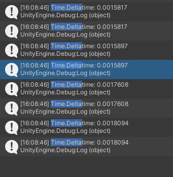
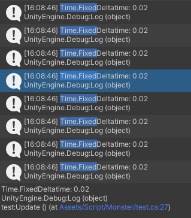

# 2023-01-03
1. 호를 그리는 궤적 생성하기(o)
2. atan과 atan2의 차이 
3. float for문의 어려움

# 2023-01-04
1. 블로그 정리(o)
2. atan과 atan2의 차이(o)
3. 쿼터니온
4. float for문의 어려움
5. 검을 장착하고 호의 수직길이와 검의 수평 길이만큼 공격범위가 시각화되고 해당 범위로 공격 처리가 되도록 설계(o)

# 2023-01-05
1. 검을 장착하고 팔을 움직일 수 있도록 설계(팔 움직이는 것만 설계)
2. 실제 적 구현(Enemy stats 일부 구현)
3. 검 공격 효과 애니메이션 처리와 데미지 처리(데미지 처리 일부 구현)
4. 쿼터니온
5. float for문의 어려움

# 2023-01-06
1. 검 장착(x)
2. 실제 적 구현 마무리(x)
3. 검 공격 효과 애니메이션 처리 및 데미지 처리 마무리(x)
4. 쿼터니온 정리(x)
5. float for문의 어려움(x)

# 2023-01-07
1. 검 장착(o)
2. 실제 적 구현 마무리(x)
3. 검 공격 효과 애니메이션 처리 및 데미지 처리 마무리(x)
4. 쿼터니온 정리(x)
5. float for문의 어려움(x)

+ Translate 와 Vector3 pos에 직접 더하는 것과의 차이

Translate는 현재 Transform의 상대 좌표계를 기준으로 이동시키고 transform.postion += postion은 World 좌표계를 기준으로 이동시킬 수 있다.

# 2023-01-08
1. 실제 적 구현 마무리(o)
2. 검 공격 효과 애니메이션 처리 및 데미지 처리 마무리(o)
- DrawArc2D 수정: Arc의 Start color와 end Color에 따라서 alpha를 조정해야함
- FadeAwayArc2D 수정: 한쪽은 이미 alpha가 0이니까 그부분은 제외하고 fade out 되도록 설계
- SwordAtkTrajController에서 팔의 회전 애니메이션을 추가해야함 - first, second guide object에 따라서
3. RayCastHit2D의 판정? - RaycastAll과 Raycast의 차이에 주의

[No 디버깅]
 

[ 디버깅 ]
  

1. 쿼터니온 정리(x)
2. float for문의 어려움(x)
3. swap 함수

# 2023-01-09
1. 못함(사유: 친구들이랑 놀아서)

# 2023-01-10
  
1. Zombie 이동 - 그라운드에서 떨어지지 않도록 하기, Player를 보는 방향으로 움직이게 하기(x) -> 하긴 했는데 일단 Player를 검출하는 함수와 바닥에 떨어지지 않도록 하는 함수 둘다 LocalScale을 조정하여 좌우 반전을 시키는데, 두 함수 실행이 왔다갔다 반복이 되면 저런 식으로 Scale이 왔다 갔다 한다.   

 따라서 Player에 데미지를 줄땐 넉백이 필요하고 만약 특정 범위 내에서 Player가 존재하면 Scale을 바꾸지 않으며 Animation을 정지시켜야한다. 그리고 Zombie 동작을 간단하게 설계할 수 있는 방법이 필요함

1. Player 이동 부드럽게 만들기(x)
2. UI 시스템 슬슬 만들기(x)

3. 쿼터니온 정리(x)
4. float for문의 어려움(x)
5. swap 함수

Layermask는 체크 되어있는 쪽은 인정해주는 쪽이고 안된쪽은 인정해주지않는 쪽

# 2023-01-11

  
## 1. Zombie 이동(o)

Zombie의 이동 패턴을 구현할때
1) 플레이어 탐색
2) 지면 고정 처리
3) 플레이어 인접 확인

이 세가지 패턴으로 구현을 했었는데, 매 프레임마다 처리해야하는 패턴의 우선 순위를 지정하는 것이 쉽지않았다. 

처음에는 '지면 고정 처리'가 가장 우선이 되어야한다고 생각했었지만 위에서 생겼던 부적절한 좌우 반전 반복 현상을 제거하기 위해서는 '플레이어 인접 확인'을 우선시 해야했다.  

각 패턴들은 수평 방향의 Raycast를 사용했으며 이 Raycast의 거리에 조건을 걸어야했다. 예를 들어 지면 고정 처리를 위한 지면 탐색 범위가 너무 크면 좀비의 움직임 범위가 줄어든다. 또한 지면 탐색 범위가 플레이어 인접 범위보다 적으면 "지면 고정 처리"와 "플레이어 탐색" 패턴이 짧은 주기로 반복이 되면서 위에서 관찰한 좌우 반전 반복 현상이 발생한다.

최종적으로 플레이어 탐색 범위(파란색) > 플레이어 인접 범위(빨간색) > 지면 확인 범위(검정색)이어야함을 알 수 있었다.

추가적으로 현재 2D 게임을 제작하고 있기에 3D 게임에서 해당 패턴을 구현한다면 수평 Raycast를 사용하는 것은 불가능하며 
원 형태로 주변의 지면을 탐색하고 플레이어를 탐색하고 플레이어가 인접한지 확인해야할 것이다.

## Raycast
RaycastHit2D의 경우 정의를 살펴보면

RaycastHit2D.cs

''' C

    public static implicit operator bool(RaycastHit2D hit)
        {
            return hit.collider != null;
        }

'''
이러한 연산자가 정의되어있는데, RaycastHit2D 변수 자체로 bool 값을 가지고 있으며 이는 Raycast에 맞은 collider가 존재하면 true이고 없으면 false를 반환한다.

처음에는 RaycastHit2D가 Transform과 비슷하다고 생각해서 두 RaycastHit2D 인스턴스를 비교문에 사용했지만 bool값을 비교하는 것이기 때문에 잘못된 사용법에 해당한다.

두 RaycastHit2D에 해당하는 인스턴스가 같은지 다른지 비교하려면 멤버 함수중에 transform에 접근하여 두 Transform 정보가 같은지 비교해야한다.

## float for문의 어려움(o)
보통 반복문은 int 변수를 사용하여 반복 횟수를 정수값으로 늘려가며 반복한다. 

'''
   
    for(int i = 0; i < maxRange; i++)

'''

그런데 만약 변수가 float일 경우에는 사용하기 복잡하고 범위값이 매번 달라질 경우에 몇번까지 반복될지 알 수 없다. 

''' C

    for(float i = 0; i < maxRange; i += n)

'''

마찬가지로 반복문내에서 배열 요소들을 계산하고 배열에 저장할때 배열의 크기를 예측하기 쉽지않으므로 반복문을 사용할때는 정확도가 요구되는 경우가 아니라면 int 변수를 사용하는 것이 맞다.

1. Player 이동 부드럽게 만들기(x)
2. UI 시스템 슬슬 만들기(x)

3. 쿼터니온 정리(x)
4. swap 함수: Swap 함수를 Static 함수로 만들려면 인자에 ref 키워드가 필요한데, static 함수를 메모리에 적재시키고 ref 키워드로 하는 것보다 그냥 즉석에서 tmp 변수 하나 만들고 교환하는 게 나을 듯

# 2023-01-12

1. Player 이동 부드럽게 만들기(x)
2. UI 시스템 슬슬 만들기(x)

3. 쿼터니온 정리(x)
4. ref와 out의 차이

사유: 너무 놀았음

# 2023-01-13
1. Player 이동 부드럽게 만들기(x)
2. UI 시스템 슬슬 만들기(x)

3. 쿼터니온 정리(x)
4. ref와 out의 차이

사유: 너무 놀았음

# 2023-01-14
1. Player 이동 부드럽게 만들기(x) - 이거 구현중
2. UI 시스템 슬슬 만들기(x)
3. 장착 해제(x)
4. 카메라 이동(o) - 진짜 간단하게만 했음

## deltaTime과 fixedDeltaTime
"deltaTime: The interval in seconds from the last frame to the current one 
"

deltaTime은 현재 프레임과 이전 프레임의 업데이트까지 걸린 시간을 의미한다. 

deltaTime은 FPS(Frame Per Second) 또는 Frame Rate와 연관이 깊다.
FPS는 1초당 프레임 업데이트가 이루어지는 횟수를 의미한다. Unity로 치면 1초당 몇번 Update 함수가 호출되는지를 의미한다. 이 값이 높을수록 그래픽 성능이 좋다고 볼 수 있다.

하지만 컴퓨터간의 성능 차이로 인해 각 컴퓨터마다 FPS값이 다르며 게임 진행중에서도 FPS값이 때에 따라 달라진다.

    
따라서 deltaTime의 값은 일정하지 않고 때에 따라 달라진다.

  

"FixedDeltaTime: The interval in seconds at which physics and other fixed frame rate updates"

FixedDeltaTime은 물리 연산 주기에 해당하며 고정된 값을 가진다. 초당 FixedUpdate가 몇번 호출되는지를 의미한다.

### deltaTime의 사용
deltaTime의 경우 

 ## Flip에 관해서
오브젝트가 바라보는 방향을 반전시키기 위해서 localscale의 부호를 반전하는 방법이 있다. 이때 오브젝트의 child 오브젝트들도 같이 반전이되며 world 좌표가 바뀌므로 위치를 대상으로 연산을 수행할 때 조심해야한다.

## Jstart 말고 따로 Player 오브젝트를 받을 수 있는게 필요할 수 있음
Player -> Transform도 전달받고 arm도 전달받을 수 있음
 
## etc
Sword Equip 수정()
Inspector에서 수정하는 데이터값은 Scriptable Object를 이용하여 

# 2023-01-15
1. FSM을 이용하여 상태 처리 루틴 완성하기
2. Player 이동 부드럽게 만들기
3. Sword Equip 수정() - local scale의 문제

# 2023-01-16
사유: 몸이 안좋아서 누워있었음

# 2023-01-17
1. FSM을 이용하여 상태 처리 루틴 완성하기(o)
2. Player 이동 부드럽게 만들기(ㅅ)
3. Sword Equip 수정() - local scale의 문제

## 3번 문제 해결 방안
1) Local x > 0 이면 그대로, Local x < 0 이면 반대의 world Postion값을 반환

## FSM
FSM은 switch case의 고급 버전인 것 같다. switch case 보다 직관적인 해석이 더 쉽고 복잡한 상태 전이도 가능하기 때문에 자주 사용될 것으로 보인다.

## Player 이동 부드럽게 만들기
<https://www.youtube.com/watch?v=KbtcEVCM7bw&list=LL&index=9&t=156s>
이 영상에 있는 움직임을 그대로 따라해봤다.

일단 이동은 만족스러울 정도로 구현이 되었고 점프만 좀 손보면 될 것 같다.
이 사람이 구현한 이동의 특징은 목표 속도를 지정해놓고 현재 속도와 목표 속도 간의
오차를 가해주는 힘에 입력한다. 로그 함수처럼 처음에는 초반에는 기울기가 크고 점차
목표 지점에 도달하기까지 기울기가 점차 줄어드는데,  

힘을 사용하지 않고 이동을 하기 위해서는 velocity 값을 직접 수정하거나 postion 값을 직접 수정하는 방식이 있는데, 프레임 간격에서 두 위치차이가 크게 되면 퍼포먼스에 괴리가 생긴다.(갑자기 캐릭터가 순간이동하는 것처럼 느껴진다는 뜻)

따라서 힘을 사용하게 되면 속도값이 점진적으로 증가하거나 감소하기때문에 캐릭터의 움직임도 자연스러워질 수 있다.

결론적으로 고급스러운 움직임을 구현하고 싶다면 힘(force)를 사용하라.

# 2023-01-18
2. Player 이동 부드럽게 만들기(ㅅ)
3. Sword Equip 수정() - local scale의 문제
4. Position vs Force vs Impulse으로 이동 구현하기
5. coyote time

