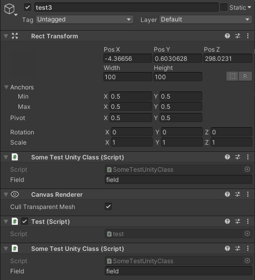
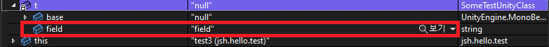

---

layout: post
title: '유니티의 Fake null 문제'
category: Unity-Solution
tag: API

---

# Fake null이란?
Fake null은 유니티에서 제공하는 'Destroy(object)' 함수를 이용하여 객체를 삭제하고 널과 비교 연산(Object == null)을 하면 참을 반환하지만 객체가 메모리에서 완전히 제거 되지않고 그 객체의 필드와 멤버를 사용할 수 있는 문제에 해당한다.  
즉, null이 아닌데 null인것처럼 인식하는 것을 의미한다.   
'==' 연산자의 오버로딩으로 인해 UnityEngine.Object의 인스턴스가 비교되어 null이 아니지만 null이라고 연산하게된다.
   

## - Wrapper 클래스
래퍼 클래스는 일반적으로 원시형의 데이터(primitive data)를 객체타입으로 사용하기위해서 새롭게 정의한 클래스를 의미한다.    
즉, 기존의 데이터를 사용자의 목적에 맞게 사용할 수 있도록 새로운 클래스를 정의한 것을 래퍼 클래스라고 한다.    
일반적으로 원래 데이터값을 참조하여 새로운 Wrapper 클래스의 인스턴스를 생성하고 이를 사용한다.

## - Unity 엔진은 원래 C++
Unity를 사용할때 스크립팅 엔진은 Mono를 사용하므로 C#을 사용한다.(IL2CPP는 예외) 그래서 유니티의 모든 기능이 C#을 이용한 것인줄 알았다.   
 하지만, 실제로 유니티 엔진은 C++로 만들어졌고 C#의 기능을 확장시켜서 개발하도록 만들어져있다.    
 기본적으로 코드를 작성할때 C#을 이용하고 유니티 에디터의 UI도 C#을 이용하여 만들어져 있다고 한다.

## - 왜 C#을 사용하는가?
이에 대한 질문은 C++과 C#의 기능을 비교해보면된다. C++과 C#의 가장 큰 차이는 메모리 할당에 있다.   
 C++의 경우 메모리 할당 및 해제 코드를 사용자가 직접 작성하여 수동으로 메모리 관리하지만 C#의 경우 자동으로 메모리 관리가 이루어진다.   

C++의 경우에는 메모리 관리가 수동으로 이루어지므로 메모리 관리 효율을 높일 수 있다는 장점이 있지만 이에 대한 코드를 더 작성해야 하므로 메모리 관리에 수고를 덜어야한다는 단점이 있다.   
C#의 경우에는 이와 반대로 메모리 관리가 자동으로 이루어지므로 메모리 관리에 대한 수고를 덜 수 있다는 장점이있다.   
따라서 유니티는 배우기 쉽게 만들기위해 이러한 C#의 기능을 채택한 것으로 보인다.

## - UnityEngine.Object 클래스
Unity 엔진은 C++로 만들어져있다. 기존의 C++ 데이터를 C# 환경(.NET)에서 사용하기위해서 만들어진 래퍼 클래스가 UnityEngine.Object 클래스이다.
이 클래스는 유니티에서 사용하는 모든 클래스의 베이스 클래스이다.
즉, 유니티에서 제공하는 Object 클래스는 UnityEngine.Object 이며 .NET에서 제공하는 System.Object와 구별된다.

## - System.Object 클래스
.NET에서 파생되는 모든 클래스의 기본클래스이다. 따라서 UnityEngine.Object 또한 .NET의 기능 상속받기때문에 System.Object를 상속받으며 유니티 오브젝트에서 .NET 오브젝트로 업캐스팅이 가능하다.(ex: (object)유니티 오브젝트)   
주의해야할 점은 object(System.Object)는 네이티브 오브젝트가 아니라 C++ 객체를 C#으로 래핑되면서 만들어진 UnityEngine.Object의 베이스 클래스이라는 점이다.  

## - Destroy 함수
유니티 객체는 두가지 객체를 가진다. 하나는 UnityEngine에서 사용하는 C++ 객체(또는 native 객체) 그리고 다른 하나는 래핑되면서 만들어진 C#(UnityEngine.Object) 객체이다.  

Destroy 함수는 실제로 삭제할때 객체를 메모리에서 완전히 제거하는 것이아니라, C++ 객체만을 제거한다.   
C#의 객체는 GC(Garbage Collector)가 수거해갈때까지 기다려야 완전히 객체에 대한 정보가 메모리에 남지않게 된다.  



    IEnumerator Start()
    {

        BoxCollider boxCollider = gameObject.AddComponent<BoxCollider>();   // BoxCollider 생성
        yield return null;
        Destroy(boxCollider);   // 삭제되는건 boxCollider의 native object, C# 래핑 객체는 GC가 수거할때까지 기다린다.
        yield return null;

        CheckWrapperObjectIsNull((object)boxCollider);
        CheckWrapperObjectIsNull(boxCollider);

        
       
        

    }

    public void CheckWrapperObjectIsNull(object obj)
    {

        if(obj == null)
        {
            Debug.Log("Wrapper object is null in System.Object == operator");
        }
        else
        {
            Debug.Log("Wrapper object is not null in System.Object == operator");
            
        }

        

    }

    public void CheckWrapperObjectIsNull(Object obj)
    {

        if (obj == null)
        {
            Debug.Log("Wrapper object is null in UnityEngine.Object == operator");
           
        }
        else
        {
            Debug.Log("Wrapper object is not null in UnityEngine.Object == operator");
        }

      

    }


 CheckWrapperObjectIsNull() 메소드에 대해 하나는 System.Object으로 캐스팅하고 하나는 UnityEngine.Object으로 캐스팅하여 실행한다. 
 == 연산자가 다르게 재정의되어 System.Object와 == 연산자, UnityEngine.Object의 == 연산자가 실행된다.   
 실제로 실행시켜보면 다음과 같은 결과를 얻는다.

  

System.Object의 == 연산자로 null 체크를 하면 거짓을 반환하지만 UnityEngine.Object ==의 연산자로 null 체크를 하면 참을 반환한다.  
 다음 문단에서 설명할테지만 null 체크를 할때 == 연산자가 전자의 경우 native 객체뿐만아니라 C# 오브젝트까지 사라졌는지 확인하지만 후자의 경우 native 객체가 사라졌는지만 확인하기때문에 위와 같은 결과를 얻게된다.

 참고로, Destroy 함수를 실행하면 네이티브 오브젝트(C++ 데이터)가 사라지므로 .NET의 기능을 더이상 사용하지 못한다.  
즉, native object는 실제 객체의 알맹이이고 C#으로 래핑된 부분은 C# 기능을 사용하기 위한 껍데기라고 볼 수 있다.

## - == 연산자(중요)
Destroy 함수로 객체를 제거하여 C++ 객체를 제거했지만 C#의 객체를 GC가 아직 수거해가지않은 상황에서 '== null' 과같은 널체크가 이루어지면 어떻게 될까?     
먼저 우리가 코드를 작성할때 "GameObject obj == null" 과 같은 연산이 실행되면 UnityEngine.Object 클래스에 정의된 == 연산자를 오버로드하여 호출한다.     
오버로딩된 == 연산자는 정의를 찾아보면 다음과 같다.

(* visual studio와 같은 개발환경에서 UnityEngine.Object 를 작성한 후 왼쪽 클릭 -> 정의로 이동 -> ctrl+F -> operator == 입력)


public static bool operator ==(Object x, Object y)
{
    return CompareBaseObjects(x, y);
}
  

위 연산자 ==는 UnityEngine.Object에 정의되어있는 연산자이다. obj == null 연산시 x는 obj,
y는 null이 입력된다.


private static bool CompareBaseObjects(Object lhs, Object rhs)
{
    bool flag = (object)lhs == null;
    bool flag2 = (object)rhs == null;
    if (flag2 && flag)
    {
        return true;
    }

    if (flag2)
    {
        return !IsNativeObjectAlive(lhs);
    }

    if (flag)
    {
        return !IsNativeObjectAlive(rhs);
    }

    return lhs.m_InstanceID == rhs.m_InstanceID;
}


obj == null에서 rhs는 null이고 lhs는 obj이므로 flag2에서 true를 반환한다. flag는 false를 반환한다.   
flag2가 참이므로 lhs(obj)를 대상으로 해당 객체의 네이티브 객체가 제거되었는지 검사한다.    
Destroy함수에 의해 해당 객체의 Native 오브젝트가 사라졌음을 가정하므로 결국 CompareBaseObjects(..) 메소드는 true를 반환한다.   

**따라서 UnityEngine.Object의 == 연산자로 null 체크를 할때 오브젝트의 네이티브 오브젝트가 사라졌기만 하면 해당 오브젝트를 null로 취급하라는 점이다.   
즉, C#의 래핑된 데이터가 살아있음에도 불구하고 오브젝트의 네이티브 오브젝트가 없기만하면 해당 데이터를 null로 취급하라는 점이 이 fake null의 가장 큰 원인이라 볼 수 있다.**


private static bool IsNativeObjectAlive(Object o)
{
    if (o.GetCachedPtr() != IntPtr.Zero)
    {
        return true;
    }

    if (o is MonoBehaviour || o is ScriptableObject)
    {
        return false;
    }

    return DoesObjectWithInstanceIDExist(o.GetInstanceID());
}

obj는 Destroy함수에 의해 네이티브 객체(C++ 객체)가 제거되었다고 하면 해당 함수는 true를 반환한다.   
참고로 IntPtr은 네이티브 코드에서 사용하는 메모리 포인터로 IntPtr.zero는 네이티브 영역에서 null와 동일한 의미를 갖는다.  
 즉, 네이티브 객체가 사라지면 IntPtr.zero 와 동일한 포인터값(m_CachedPtr)을 가지게 된다.

## - C# 인스턴스의 필드 접근
Destroy 함수를 사용하면 C++ 사이드의 인스턴스가 사라지므로 .NET의 기능, 유니티 엔진의 기능을 사용하지 못하고 C#의 인스턴스가 GC가 수집할때까지 남게된다.     
이때 GC가 수집하기 전까지 C#의 인스턴스에 .NET의 기능도 아닌 유니티 엔진의 기능도 아닌 필드값을 접근할 수 있을까?   
실제로 확인해보면 접근할 수 있는 것을 확인할 수 있다. 

### 준비

테스트 게임 오브젝트   

  


public class SomeTestUnityClass : MonoBehaviour{
    public string field = "field";
}


SomeTestUnityClass는 MonoBehaviour를 상속받는 커스텀 클래스이다. 


public class Test: MonoBehaviour{

IEnumerator Start()
        {
            SomeTestUnityClass t = GetComponent<SomeTestUnityClass>();

            Destroy(t); //box를 제거, 이때 native 오브젝트만을 삭제하고 C#으로 래핑된 인스턴스는 삭제하지않음

            yield return null; 
            if (t == null) //여기서 중단점
            {
                Debug.Log("t is null in UnityEngine.Object == operator");
            }
            if ((object)t == null)
            {
                Debug.Log("(object)t is null");
            }
            yield return null;
 
        }

        }


### 결과
  

t가 destroy에 의해 C++ 객체가 제거되었지만 C# 래핑 객체가 제거되지않아서 이 래핑 객체에 정의된 필드가 메모리에서 유효함을 볼 수 있다. 실제로도 로그를 출력하여 사용이 가능하다.  
따라서 이러한 비정상적인 접근이 가능해지면 메모리 누수와 같은 문제가 발생할 수 있고 Fake Null 문제로 인한 예상치못한 처리가 이루어지므로 Null 체크시 오버로딩이 아닌 다른 방법으로 검사를 해야한다.

# - Solution

## System.Object의 == 연산자 사용
UnityEngine.Object의 == 연산자는 fake null을 유발할 수 있어 이에 대한 제어 흐름을 개발자가 예상하기 어렵다.   
 UnityEngine.Object의 == 연산자는 네이티브 오브젝트가 제거되어있으면 해당 오브젝트를 null로 취급하지만 System.Object의 == 연산자는 그렇지않으므로 비교 대상 오브젝트를 System.Object로 업캐스팅하여 == 연산자를 사용하면 fake null 문제를 피할 수 있다. 
 
잘못된 경우

 GameObject obj = new GameObject();
 Destroy(obj);
 if(obj == null)
 ...


고친 경우

 GameObject obj = new GameObject();
 Destroy(obj);
 if((object)obj == null)
 ...


## 기타 메소드
+ Assert.IsnotNull(object obj, string message)
+ object.ReferenceEquals(value, null) 

# - 참고
- 래퍼 클래스란?: http://www.tcpschool.com/java/java_api_wrapper
- Fake Null  
https://overworks.github.io/unity/2019/07/22/null-of-unity-object-part-2.html  
https://overworks.github.io/unity/2019/07/16/null-of-unity-object.html#fn:1  
https://ansohxxn.github.io/unitydocs/fakenull/ 
https://jacx.net/2015/11/20/dont-use-equals-null-on-unity-objects.html
- Unity엔진은 C++?  
https://gamedevforever.com/203
- unity의 GC 방식과 Destroy  
https://answers.unity.com/questions/745685/nullreferenceexception-on-startcoroutine.html
- IntPtr: https://stackoverflow.com/questions/1148177/just-what-is-an-intptr-exactly

